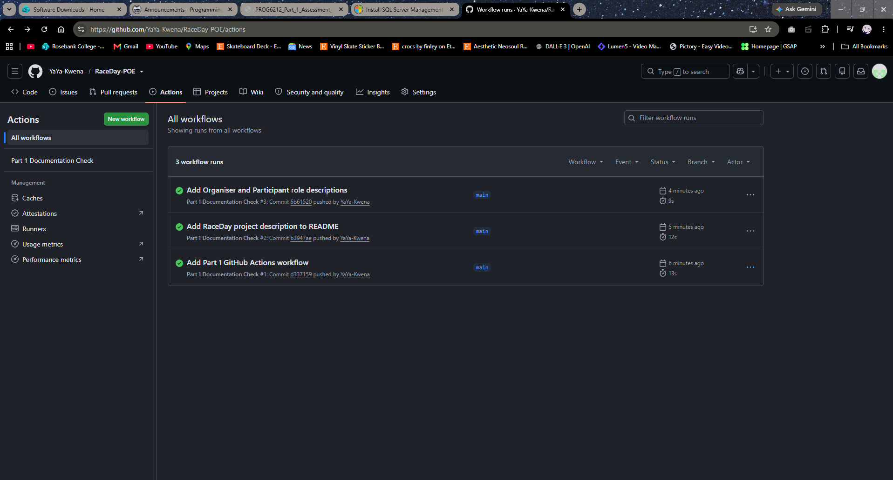

# RaceDay Event Management System

## Project Description
RaceDay is a full-stack event management platform built for South African road running, walking, and cycling events to replace paper-based registration.

## User Roles
### Organiser
Can create, edit, and delete events, manage event categories, capture participant results, and view event enrolments.

### Participant
Can create an account, browse available events, enter an event by selecting a category, view personal enrolments, and track race results.

## Database Setup
1. Open SSMS and connect to a clean SQL Server instance.
2. Open `RaceDay_Database.sql` from the `/docs` folder.
3. Execute the script to generate tables, constraints, and seed data.

## CI/CD
The GitHub Actions workflow checks that the required Part 1 files exist in the correct directories.

## Video Demonstration
YouTube Link: [https://youtu.be/bvNNprHwpd8]